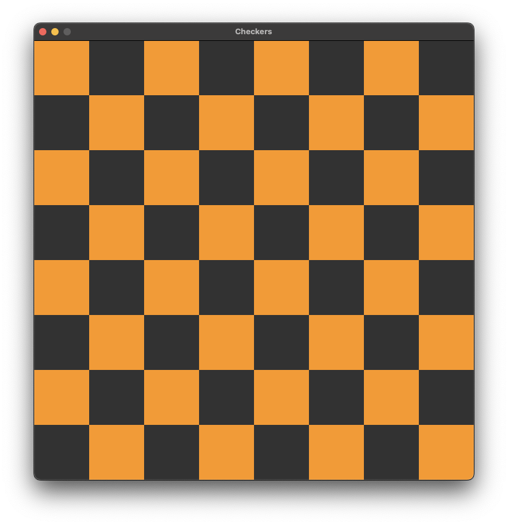

# Checkers



# \*Currently in development

## Cloning the Repository

To clone the repository with all submodules, use:

```bash
git clone git@github.com:oleksandrh324110/Checkers.git --recursive && cd Checkers
```

If you forgot to use `--recursive`, you can initialize and update the submodules later:

```bash
git submodule init
git submodule update
```

## Building and Running

To build and run the project, follow these steps:

1. Create a build directory and navigate into it:

   ```bash
   mkdir build && cd build
   ```

2. Generate the build files using CMake:

   ```bash
   cmake .. -G Ninja
   ```

3. Compile the project using `ninja`:

   ```bash
   ninja
   ```

4. Run the executable:

   ```bash
   ./main
   ```
